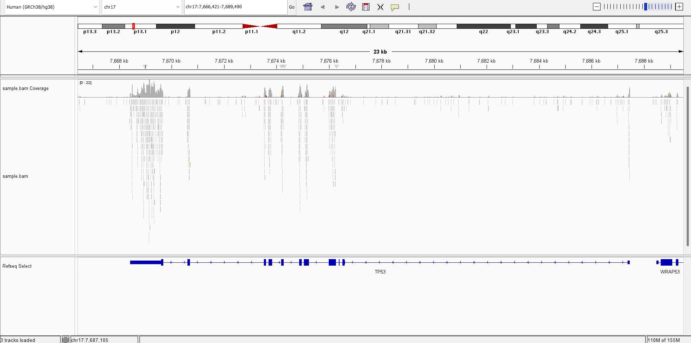
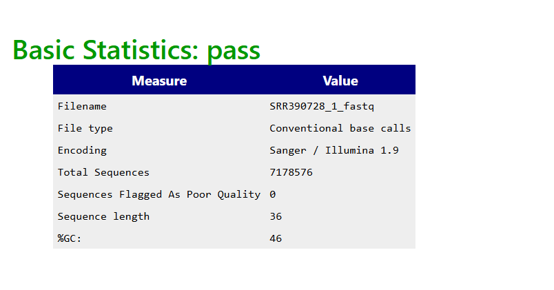
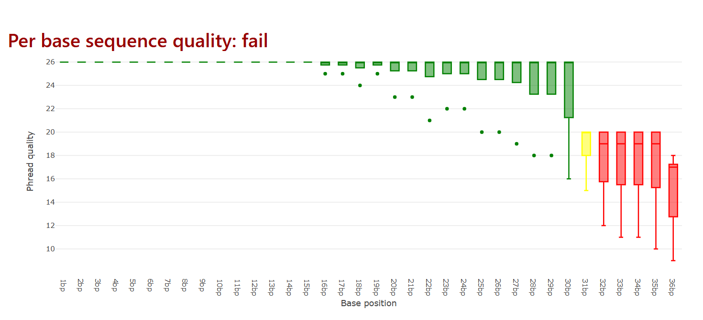
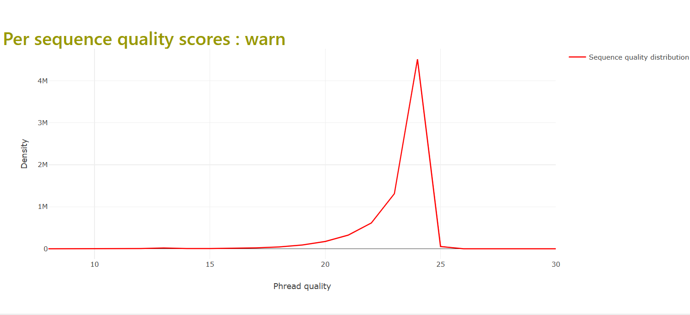
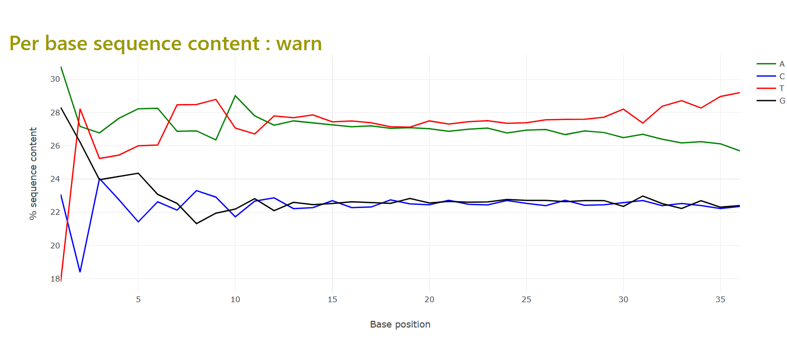
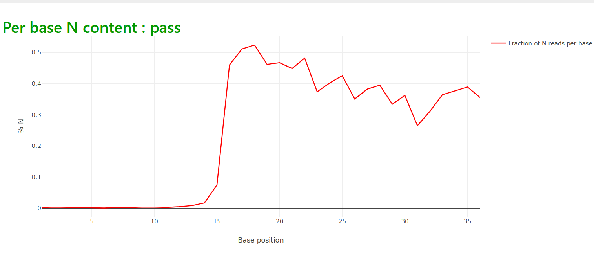
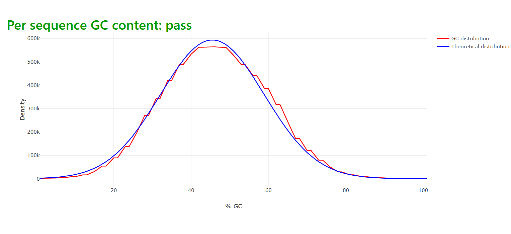
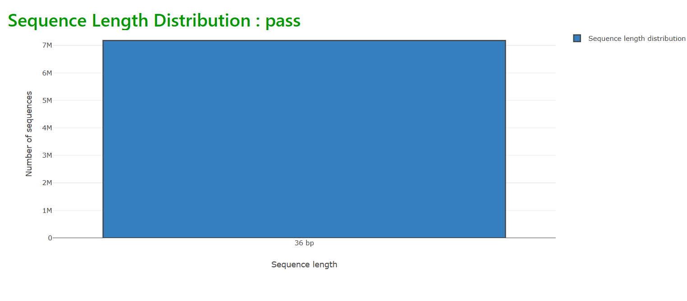
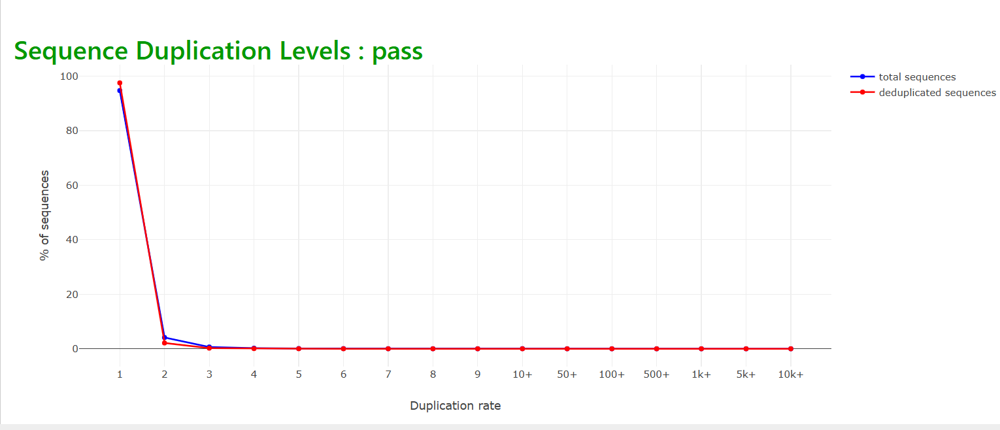
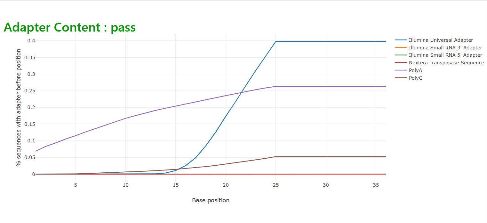

## Objective
To perform an end-to-end RNA-Seq analysis pipeline on real sequencing data, replicating workflows used in bioinformatics research.
 
# NGS RNA-Seq Analysis Pipeline


## Overview
This project demonstrates a complete RNA-Seq data analysis workflow, starting from raw sequencing data to alignment and visualization. It replicates real-world bioinformatics pipelines used in research and industry.

---

## Workflow

SRA → FASTQ → Quality Control → Trimming → Alignment → BAM → Visualization

---

## Dataset

- Source: NCBI SRA  
- Accession: SRR390728  
- Type: RNA-Seq (single-end)  
- Total Reads: ~7 million  

---

## Tools Used

- SRA Toolkit  
- Falco (FastQC alternative)  
- Trimmomatic  
- Bowtie2  
- SAMtools  
- IGV  

---

## Pipeline Steps

### Data Acquisition
- Downloaded sequencing data using SRA Toolkit  
- Converted SRA → FASTQ format  

### Quality Control
- Performed QC using Falco  
- Identified low-quality bases at read ends  

### Trimming
- Applied Trimmomatic  
- Removed low-quality bases to improve read quality  

### Alignment
- Aligned reads to human reference genome (hg38) using Bowtie2  

### Alignment Evaluation
- Used SAMtools flagstat  
- Achieved **93.5% mapping rate**  

### Visualization
- Visualized BAM file using IGV  
- Verified correct read alignment and coverage  

---

## Results

- Total Reads: ~7.1 million  
- Mapped Reads: ~93.5%  
- High-quality alignment confirmed  

---

## 📸 Results Visualization

### 🔬 IGV Visualization (TP53 Gene)


Aligned RNA-seq reads mapped to the TP53 gene region showing clear coverage peaks.

---

### 📊 Quality Control (Falco)

#### Basic Statistics


#### Per Base Sequence Quality


#### Per Sequence Quality Scores


#### Per Base Sequence Content


#### Per Base N Content


#### GC Content


#### Sequence Length Distribution


#### Sequence Duplication Levels


#### Adapter Content

---

##  How to Run

```bash
prefetch SRR390728
fasterq-dump SRR390728
trimmomatic SE input.fastq trimmed.fastq SLIDINGWINDOW:4:20 MINLEN:25
bowtie2 -x hg38 -U trimmed.fastq -S output.sam
samtools view -bS output.sam > output.bam
samtools flagstat output.bam
```
---

## 🔍 Key Insights

- High alignment rate (~93.5%) indicates high-quality sequencing data  
- Coverage peaks correspond to expressed genomic regions  
- Minimal adapter contamination confirms data reliability

---

## Conclusion
This project demonstrates practical experience with NGS data processing, alignment, and biological interpretation.

The pipeline successfully processed RNA-Seq data, demonstrating effective preprocessing, high-quality alignment, and accurate visualization of genomic reads.

This project reflects hands-on experience with real bioinformatics workflows used in research and industry.

---

## Skills Demonstrated
- NGS Data Analysis  
- RNA-Seq Pipeline  
- Sequence Alignment  
- Bioinformatics Tools

--- 

## Author

**Kartikeya Sharma**  
Bioinformatics Student
